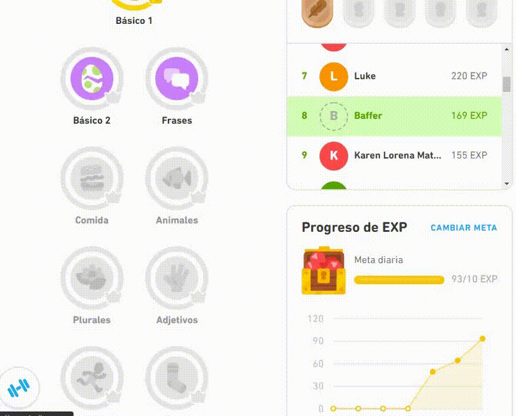
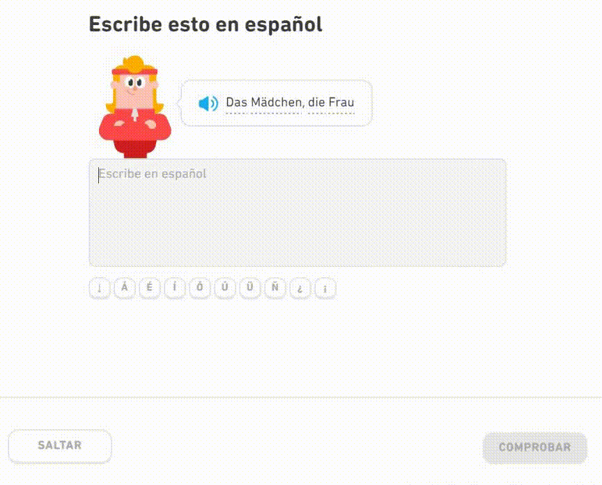

# pyDuolingoBot
This repository contains a bot to solve [Duolingo](https://www.duolingo.com/) exercises automatically using web scraping. It is implemented with Python and [Selenium](https://www.selenium.dev/).

# Motivation
The motivation for the creation of this repository is completely didactic and my main goal was to learn to use Selenium and improve my Python skills. I've been wanting to learn something about web scraping for a long time and I've been using Duolingo for years to learn German, so combine both. 

I want to clarify that I have not used this bot with my personal account and really with any other account :wink: (only with a secondary account to try on a couple of levels). If you're learning with Duolingo, I don't recommend skipping levels by cheating, but it's up to you anyway.

# How it works

# How to install

